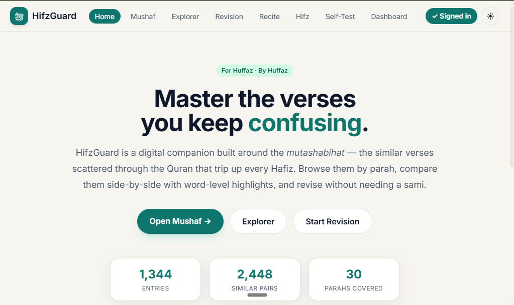
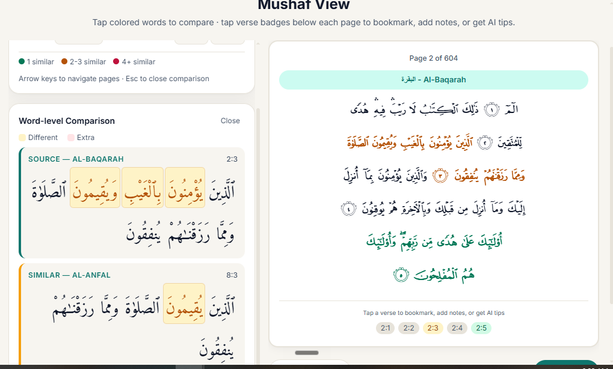
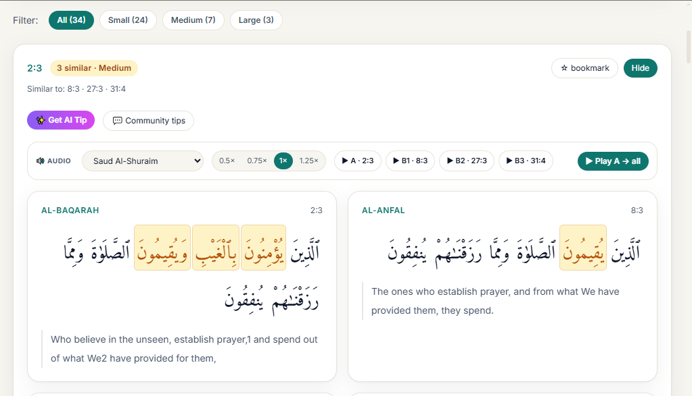

# HifzGuard — Mutashabihat Hifz Companion

**Live app:** <https://hifz-guard.vercel.app/explorer>

HifzGuard is a digital companion built for Quran memorizers (huffaz). It solves the hardest part of hifz: the 3,000+ **mutashabihat** — verses scattered across the Quran that share identical or near-identical openings, but diverge in small, critical ways. Every hafiz knows the feeling of being pulled into the wrong surah mid-recitation. HifzGuard makes those exact spots visible, comparable, and testable — on any device, any time.

---

## Who this is for

- **Students of hifz** who are currently memorizing and want to avoid confusion between similar ayat.
- **Huffaz** who have completed hifz and are revising, and want a faster way than flipping through printed mutashabihat books.
- **Teachers** who want to point students to exact pairs of similar verses with clear word-by-word differences.
- **Anyone** doing daily Quran reading who wants to notice the patterns in the Quran's language.

You do not need to be a developer. You do not need to install anything. Just open the link.

---

## Screenshots

### Home — Dashboard overview

### Mushaf — Color-coded Quran with word-level comparison

### Explorer — Browse every similar verse pair

---

## What you can do inside the app

The app has six sections: **Mushaf**, **Explorer**, **Revision**, **Recite**, **Hifz**, and **Self-Test**.

### Mushaf — read the Quran the way you memorized it

This is the traditional 604-page mushaf view. You can turn pages one by one, jump to any parah, and read the exact same line-by-line layout you are used to from the printed Quran.

The difference: every word that is a mutashabih — a word that appears at the start of a verse with siblings elsewhere — is gently colored.

- **Green** means this verse has 1 similar verse elsewhere.
- **Amber** means it has 2 or 3.
- **Red** means it has 4 or more.

Tap any colored word and the app immediately shows you, side by side, the other verses that share this opening — with the matching words in normal color and the **different words highlighted in amber**. You can see, at a glance, exactly where the two ayat split.

### Explorer — browse every similar verse in a parah or surah

Select a parah (1–30) or a surah, and you get a clean list of every verse in that range that has mutashabihat. Each card tells you:

- Which verse it is (e.g., **2:3**)
- How many similar verses it has across the Quran
- Whether the pattern is **Small** (1–2 words differ), **Medium**, or **Large** (3+ shared opening words)
- A **+ context** tag when the similarity carries into the next ayah

The app shows the source verse next to each similar verse with word-level highlighting. You can also get an **AI-generated mnemonic** for any confusing pair, or listen to audio for each verse at different speeds.

You can **bookmark** any card you find tricky, so you can come back to it later.

### Revision — go through a parah, with proactive warnings

Pick a parah you are revising. Move through it verse by verse. When you reach a verse that has mutashabihat, HifzGuard shows an alert before you continue: *"This verse starts identically to 3:119 and 4:61 — pay attention here."*

You can open the side-by-side comparison right there, without losing your place. Your daily revision is logged, and your streak keeps going as long as you keep coming back.

### Recite — voice-powered recitation tracking

Recite an ayah out loud and the app follows along word by word, using your browser's speech recognition. If you drift into a similar verse — a common mistake with mutashabihat — HifzGuard detects it and alerts you in real time.

### Self-Test — check yourself

The app shows you the first few words of a mutashabih verse. You tell it which surah and ayah this version belongs to. If you get it wrong, the app shows the verse you confused it with — side by side, differences highlighted — and saves that mistake to your bookmarks.

It is the digital version of being tested by a sami, without needing to schedule one.

### Hifz Tracker — manage your memorization plan

A traditional three-tier revision system:
- **Sabaq** — what you are currently memorizing
- **Sabqi** — recent memorized material to keep fresh
- **Manzil** — the full rotation system for long-term retention

A 30-parah heatmap shows your overall memorization status. The app generates your daily revision plan automatically and logs activity to your Quran.com account.

---

## How to use HifzGuard in your daily routine

1. **Before your daily revision** — open **Explorer**, select the parah you are revising, and skim the cards. You will see in advance which ayat will try to trick you.
2. **During revision** — keep **Revision** mode open. When an alert appears, pause, look at the comparison, then continue.
3. **At the end of the week** — open **Self-Test** and run through the parahs you revised. Anything you miss gets bookmarked.
4. **When stuck on a confusing pair** — go to **Mushaf**, find the page, tap the colored word, and study the siblings together.

---

## A few things worth knowing

- **Every Arabic verse is shown in full Uthmani script with tashkeel.** Nothing is stripped. The script uses the same font family as the printed mushaf.
- **Bookmarks sync to your Quran.com account** when you sign in, so they travel with you between devices.
- **AI mnemonics** use Gemini 2.5 Flash to generate memory tricks for confusing verse pairs.
- **Dark mode is supported** for late-night reading.
- **Mobile-first.** Designed around a phone screen — because that is where most revision happens.
- **Free to use.** No subscriptions, no ads.

---

## With sincerity

This app was built with the intention of making the hifz journey a little easier for anyone working to carry the Quran in their heart. It stands on the work of scholars and teachers who compiled mutashabihat knowledge over centuries. It is meant to be a quiet, always-available companion in the moments in between.

May Allah accept it from us and from you, and may He make the Quran the spring of your heart.

**Open the app:** <https://hifz-guard.vercel.app/explorer>
